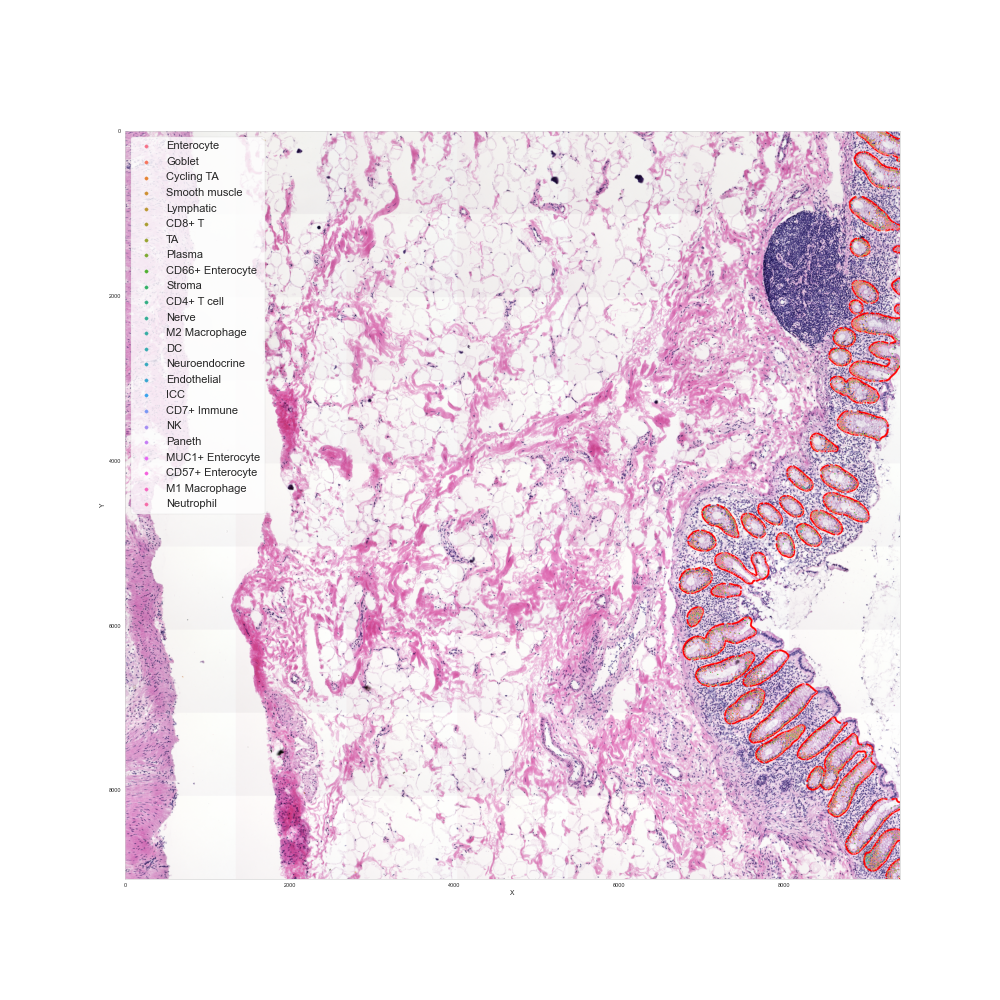
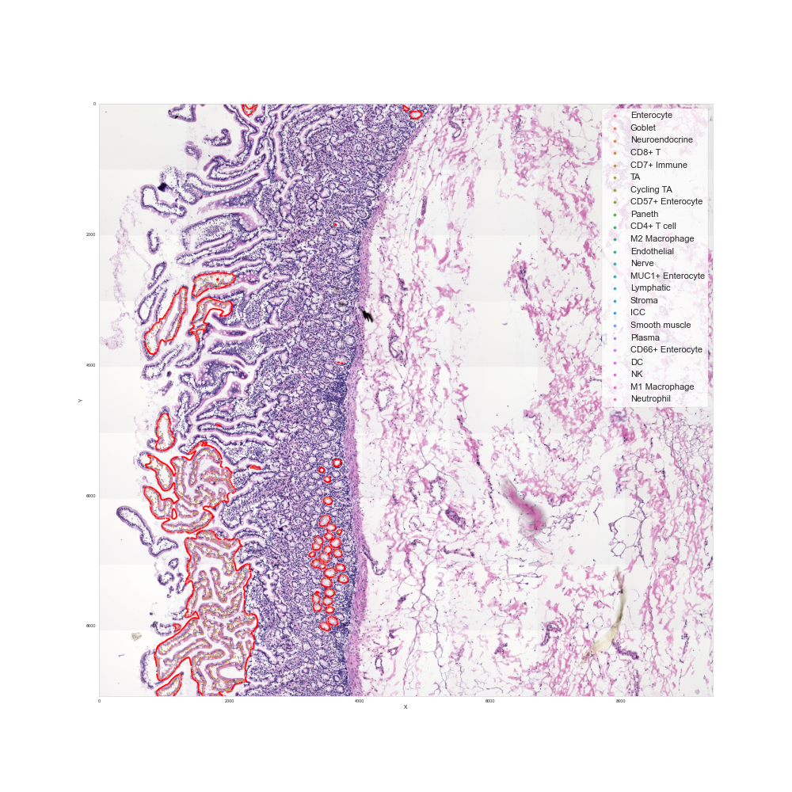

#  Preview: Cell Type within an FTU Visualization for Intestine Data

HuBMAP Atlas Previews demonstrate functionality and resources that will become available in future HuBMAP portal releases. Previews may rely on externally hosted data or analysis results that were generated with processing pipelines that are not yet integrated into the HuBMAP data infrastructure.

### Description

This preview showcases visualizations of cell types found within a functional tissue unit.
Experimental data from the “[High Resolution Single Cell Maps Reveals Distinct Cell Organization and Function Across Different Regions of the Human Intestine](https://www.biorxiv.org/content/early/2021/11/25/2021.11.25.469203)” paper, is used to compute cell type counts within functional tissue units in 2D volumes of digital intestine biopsy data generated using multiplexed imaging on 64 sections of the human intestine (~16 mm2) from 8 donors (B004, B005, B006, B008, B009, B010, B011, and B012) using a panel of 57 oligonucleotide-barcoded antibodies. Subsequently, images underwent standard CODEX image processing (tile stitching, drift compensation, cycle concatenation, background subtraction, deconvolution, and determination of best focal plane), single cell segmentation, and column marker z-normalization by tissue. The outputs of this process were data frames of 2.6 million cells with 57 antibody fluorescence values quantified from each marker. Each cell has its cell type, cellular neighborhood, community of neighborhooods, and tissue unit defined with x, y coordinates representing pixel location in the original image. This data was taken from  8 donors with 8 individual tissue regions (64 tissues imaged) across 2.6 million cells, with 25 cell types, 20 multicellular neighborhoods, 10 communities of neighborhoods, and 3 tissue segments could be used to understand the cellular interactions, composition, and structure of the human intestine from the duodenum to the sigmoid colon and understand differences between different areas of the intestine. 

### Atlas Details

This Preview showcases visualizations of different cell types(NK, M1 Macrophage, CD8+ T, DC, M2 Macrophage, B, Neutrophil, Plasma, CD4+ T cell, CD7+ Immune) within a functional tissue unit.  

### Experimental Data Details

The experimental intestine data used here is detailed in the “[High Resolution Single Cell Maps Reveals Distinct Cell Organization and Function Across Different Regions of the Human Intestine](https://www.biorxiv.org/content/early/2021/11/25/2021.11.25.469203)” paper.

### Contributors
**Intestine Data:** John Hickey et al.

**Cell Type Visualization:** Abhiroop Tejomay, & Katy Börner

### Attribution

| Group  | Creator                          |
|--------|----------------------------------|
| TMC-Stanford | John Hickey (jwhickey@stanford.edu) |
| MC-IU  | Katy Börner (katy@indiana.edu)   |

### Visualization

  <ul class="nav nav-tabs">
    <li class="active"><a data-toggle="tab" href="#region1">Region 1</a></li>
    <li><a data-toggle="tab" href="#region2">Region 2</a></li>
    <li><a data-toggle="tab" href="#region3">Region 3</a></li>
    <li><a data-toggle="tab" href="#region4">Region 4</a></li>
    <li><a data-toggle="tab" href="#region5">Region 5</a></li>
    <li><a data-toggle="tab" href="#region6">Region 6</a></li>
    <li><a data-toggle="tab" href="#region7">Region 7</a></li>
    <li><a data-toggle="tab" href="#region8">Region 8</a></li>
    <li><a data-toggle="tab" href="#region9">Region 9</a></li>
    <li><a data-toggle="tab" href="#region10">Region 10</a></li>
    <li><a data-toggle="tab" href="#region11">Region 11</a></li>
    <li><a data-toggle="tab" href="#region12">Region 12</a></li>
    <li><a data-toggle="tab" href="#region13">Region 13</a></li>
    <li><a data-toggle="tab" href="#region14">Region 14</a></li>
    <li><a data-toggle="tab" href="#region15">Region 15</a></li>
    <li><a data-toggle="tab" href="#region16">Region 16</a></li>
    <li><a data-toggle="tab" href="#region17">Region 17</a></li>
    <li><a data-toggle="tab" href="#region18">Region 18</a></li>
    <li><a data-toggle="tab" href="#region19">Region 19</a></li>
    <li><a data-toggle="tab" href="#region20">Region 20</a></li>
    <li><a data-toggle="tab" href="#region21">Region 21</a></li>
    <li><a data-toggle="tab" href="#region22">Region 22</a></li>
    <li><a data-toggle="tab" href="#region23">Region 23</a></li>
    <li><a data-toggle="tab" href="#region24">Region 24</a></li>
    <li><a data-toggle="tab" href="#region25">Region 25</a></li>
    <li><a data-toggle="tab" href="#region26">Region 26</a></li>
    <li><a data-toggle="tab" href="#region27">Region 27</a></li>
    <li><a data-toggle="tab" href="#region28">Region 28</a></li>
    <li><a data-toggle="tab" href="#region29">Region 29</a></li>
    <li><a data-toggle="tab" href="#region30">Region 30</a></li>
  </ul>

  
  

    

      <h3>Region 1</h3>
      
      
 Open the visualization in <a target="_blank" href="https://cns-iu.github.io/hra-interactive-ftu-computation/viz/B009A_reg001_HE_montage.png" >new window.</a>  
    

    

      <h3>Region 2</h3>
        
        
 Open the visualization in <a target="_blank" href="https://cns-iu.github.io/hra-interactive-ftu-computation/viz/B009A_reg002_HE_montage.png" >new window.</a>
  

    

      <h3>Region 3</h3>
        
        
 Open the visualization in <a target="_blank" href="https://cns-iu.github.io/hra-interactive-ftu-computation/viz/region_3.html" >new window.</a>
    

    

      <h3>Region 4</h3>
        
        
 Open the visualization in <a target="_blank" href="https://cns-iu.github.io/hra-interactive-ftu-computation/viz/region_4.html" >new window.</a>
    

    

      <h3>Region 5</h3>
        
        
 Open the visualization in <a target="_blank" href="https://cns-iu.github.io/hra-interactive-ftu-computation/viz/region_5.html" >new window.</a>
    

    

      <h3>Region 6</h3>
        
        
 Open the visualization in <a target="_blank" href="https://cns-iu.github.io/hra-interactive-ftu-computation/viz/region_6.html" >new window.</a>
    

    

      <h3>Region 7</h3>
        
        
 Open the visualization in <a target="_blank" href="https://cns-iu.github.io/hra-interactive-ftu-computation/viz/region_7.html" >new window.</a>
    

    

      <h3>Region 8</h3>
        
        
 Open the visualization in <a target="_blank" href="https://cns-iu.github.io/hra-interactive-ftu-computation/viz/region_8.html" >new window.</a>
    

    

      <h3>Region 9</h3>
        
        
 Open the visualization in <a target="_blank" href="https://cns-iu.github.io/hra-interactive-ftu-computation/viz/region_9.html" >new window.</a>
    

    

      <h3>Region 10</h3>
        
        
 Open the visualization in <a target="_blank" href="https://cns-iu.github.io/hra-interactive-ftu-computation/viz/region_10.html" >new window.</a>
    

    

      <h3>Region 11</h3>
        
        
 Open the visualization in <a target="_blank" href="https://cns-iu.github.io/hra-interactive-ftu-computation/viz/region_11.html" >new window.</a>
    

    

      <h3>Region 12</h3>
        
        
 Open the visualization in <a target="_blank" href="https://cns-iu.github.io/hra-interactive-ftu-computation/viz/region_12.html" >new window.</a>
    

    

      <h3>Region 13</h3>
        
        
 Open the visualization in <a target="_blank" href="https://cns-iu.github.io/hra-interactive-ftu-computation/viz/region_13.html" >new window.</a>
    

    

      <h3>Region 14</h3>
        
        
 Open the visualization in <a target="_blank" href="https://cns-iu.github.io/hra-interactive-ftu-computation/viz/region_14.html" >new window.</a>
    

    

      <h3>Region 15</h3>
        
        
 Open the visualization in <a target="_blank" href="https://cns-iu.github.io/hra-interactive-ftu-computation/viz/region_15.html" >new window.</a>
    

    

      <h3>Region 16</h3>
        
        
 Open the visualization in <a target="_blank" href="https://cns-iu.github.io/hra-interactive-ftu-computation/viz/region_16.html" >new window.</a>
    

    

      <h3>Region 17</h3>
        
        
 Open the visualization in <a target="_blank" href="https://cns-iu.github.io/hra-interactive-ftu-computation/viz/region_17.html" >new window.</a>
    

    

      <h3>Region 18</h3>
        
        
 Open the visualization in <a target="_blank" href="https://cns-iu.github.io/hra-interactive-ftu-computation/viz/region_18.html" >new window.</a>
    

    

      <h3>Region 19</h3>
        
        
 Open the visualization in <a target="_blank" href="https://cns-iu.github.io/hra-interactive-ftu-computation/viz/region_19.html" >new window.</a>
    

    

      <h3>Region 20</h3>
        
        
 Open the visualization in <a target="_blank" href="https://cns-iu.github.io/hra-interactive-ftu-computation/viz/region_20.html" >new window.</a>
    

    

      <h3>Region 21</h3>
        
        
 Open the visualization in <a target="_blank" href="https://cns-iu.github.io/hra-interactive-ftu-computation/viz/region_21.html" >new window.</a>
    

    

      <h3>Region 22</h3>
        
        
 Open the visualization in <a target="_blank" href="https://cns-iu.github.io/hra-interactive-ftu-computation/viz/region_22.html" >new window.</a>
    

    

      <h3>Region 23</h3>
        
        
 Open the visualization in <a target="_blank" href="https://cns-iu.github.io/hra-interactive-ftu-computation/viz/region_23.html" >new window.</a>
    

    

      <h3>Region 24</h3>
        
        
 Open the visualization in <a target="_blank" href="https://cns-iu.github.io/hra-interactive-ftu-computation/viz/region_24.html" >new window.</a>
    

    

      <h3>Region 25</h3>
        
        
 Open the visualization in <a target="_blank" href="https://cns-iu.github.io/hra-interactive-ftu-computation/viz/region_25.html" >new window.</a>
    

    

      <h3>Region 26</h3>
        
        
 Open the visualization in <a target="_blank" href="https://cns-iu.github.io/hra-interactive-ftu-computation/viz/region_26.html" >new window.</a>
    

    

      <h3>Region 27</h3>
        
        
 Open the visualization in <a target="_blank" href="https://cns-iu.github.io/hra-interactive-ftu-computation/viz/region_27.html" >new window.</a>
    

    

      <h3>Region 28</h3>
        
        
 Open the visualization in <a target="_blank" href="https://cns-iu.github.io/hra-interactive-ftu-computation/viz/region_28.html" >new window.</a>
    

    

      <h3>Region 29</h3>
        
        
 Open the visualization in <a target="_blank" href="https://cns-iu.github.io/hra-interactive-ftu-computation/viz/region_29.html" >new window.</a>
    

    

      <h3>Region 30</h3>
        
        
 Open the visualization in <a target="_blank" href="https://cns-iu.github.io/hra-interactive-ftu-computation/viz/region_30.html" >new window.</a>
    

